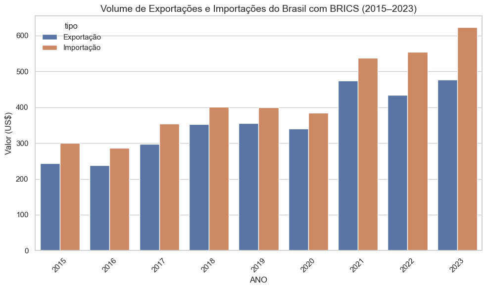
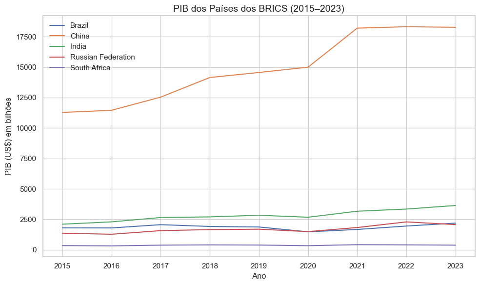
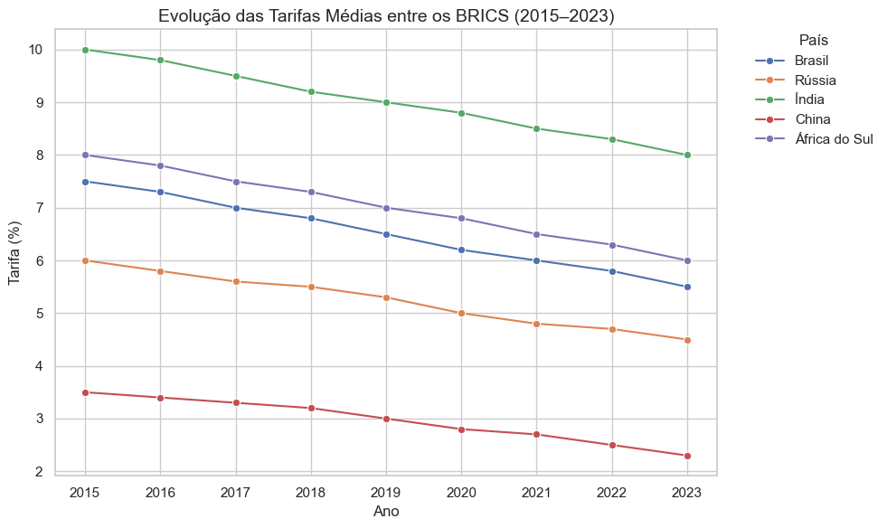
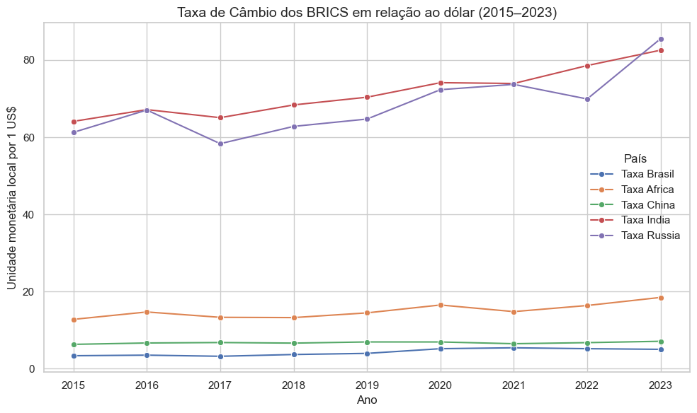
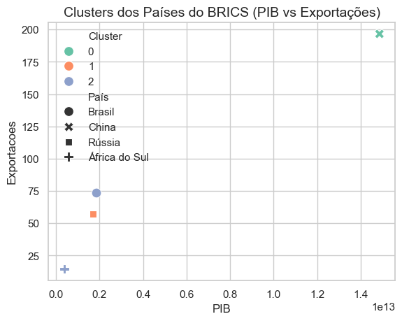
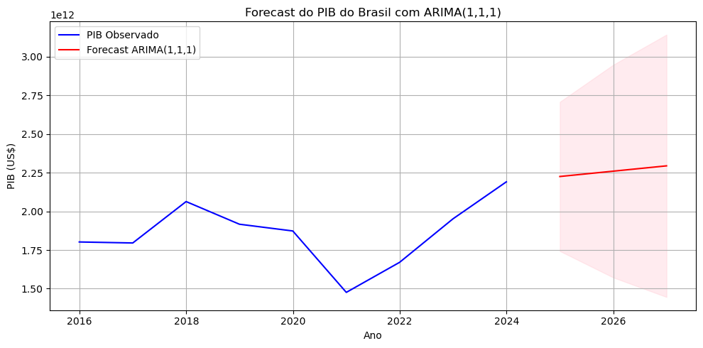

# 📊 Fatores Macroeconômicos que Influenciam o PIB dos BRICS (2015–2023)

Este repositório contém os notebooks, bases de dados e gráficos utilizados no Trabalho de Conclusão de Curso (TCC) de **Vinicius Fantini**, que analisa a influência de variáveis comerciais e macroeconômicas sobre o Produto Interno Bruto (PIB) dos países do BRICS (Brasil, Rússia, Índia, China e África do Sul) no período de 2015 a 2023.

---

## 🗂 Estrutura do Repositório

- `notebooks/` → Notebooks Jupyter com todas as etapas da análise
  - `01_EDA.ipynb` → Análise exploratória, tratamento dos dados e visualizações iniciais   
  - `02_ARIMA.ipynb` → Previsão do PIB com ARIMA  
- `dados/` → Bases de dados utilizadas (UN Comtrade, Banco Mundial, FMI, OMC)  
- `graficos/` → Gráficos e visualizações exportadas  
- `README.md` → Este documento  

---

## 🎯 Objetivos

- Avaliar como variáveis comerciais e macroeconômicas — exportações, importações, taxa de câmbio e tarifas — impactam o PIB dos países do BRICS.  
- Identificar padrões temporais e agrupamentos econômicos por meio de **Clusterização K-Means**.  
- Projetar a evolução futura do PIB, com foco no Brasil, utilizando **modelos de séries temporais ARIMA**.  

---

## 🧠 Metodologia

1. **Coleta de Dados**  
   - Exportações, Importações e Tarifas → [UN Comtrade](https://comtradeplus.un.org/)  
   - PIB → [World Bank](https://data.worldbank.org/indicator/NY.GDP.MKTP.CD)  
   - Taxa de câmbio → [IMF](https://data.imf.org/regular.aspx?key=61545865)  
   - Tarifas comerciais → [WTO](https://www.wto.org/english/res_e/statis_e/tariff_profiles_e.htm)  

2. **Modelagem Quantitativa**  
   - **Regressão Linear Múltipla** → impacto das variáveis no PIB individualmente e de forma agregada  
   - **Clusterização (K-Means)** → agrupamento de anos em 3 clusters (crise, estabilidade e recuperação)  
   - **ARIMA (1,1,1)** → projeção do PIB do Brasil para 2024  

3. **Validações Estatísticas**  
   - Testes de normalidade (Shapiro-Wilk, Box-Cox)  
   - Multicolinearidade (VIF, Stepwise)  
   - Homocedasticidade (Breusch-Pagan)  

---

## 📊 Principais Resultados

- **Taxa de câmbio** foi a variável mais significativa para explicar o PIB brasileiro e no modelo agregado dos BRICS.  
- **Tarifas comerciais** tiveram impacto relevante na China e no modelo conjunto do bloco.  
- **Clusterização K-Means** identificou 3 fases distintas:  
  - Cluster 0 → crise (2015–2016)  
  - Cluster 1 → estabilidade (2017–2019)  
  - Cluster 2 → recuperação pós-pandemia (2021–2022)  
- **ARIMA (1,1,1)** para o Brasil projetou crescimento moderado em 2024, indicando recuperação sustentável.  

---

## 📸 Visualizações

### Exportações e Importações do Brasil com BRICS


### PIB dos Países do BRICS


### Tarifas Comerciais Médias


### Taxa de Câmbio


### Clusterização (K-Means)


### Previsão do PIB (ARIMA – Brasil)


---

## 🚀 Como Executar

1. Clone o repositório:
   ```bash
   git clone https://github.com/Vinicius-Fantini/Analise_BRICS.git

👤 Autor
Vinicius Fantini
📩 Email: vinicius.fantini1302@gmail.com
🔗 LinkedIn - Vinicius Fantini, CEA
